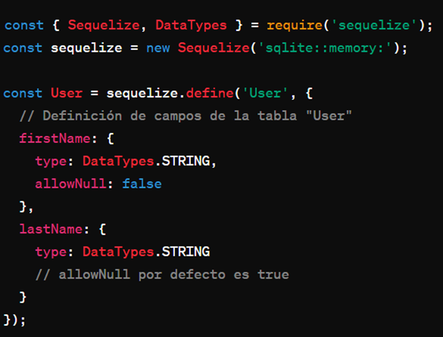

ORM NEST.JS

ORM simplifica la interacción con la base de datos al permitir a los desarrolladores trabajar con objetos y clases en lugar de SQL directo. Por ejemplo, en Sequelize para Node.js, se pueden definir modelos de datos usando clases JavaScript para representar las tablas en la base de datos:

Reflexión

ORM ofrece beneficios en términos de productividad y mantenibilidad del código. Sin embargo, puede haber desafíos al principio, como entender conceptos avanzados y optimizar consultas complejas.

Analogía

ORM se puede comparar con un traductor que facilita la comunicación entre dos personas que hablan diferentes idiomas. Al igual que un traductor convierte el significado de las palabras y frases de un idioma a otro, ORM mapea los objetos y clases de la aplicación a las tablas y relaciones de la base de datos relacional.

Resumen

ORM actúa como un traductor entre el código de programación y la base de datos, simplificando la comunicación y proporcionando una manera más intuitiva de trabajar con datos en aplicaciones web y móviles.

Referencia de libros

Smith, XYZ. (2023). Mastering ORM: A Comprehensive Guide to Object-Relational Mapping. 
Fernández, ABC. (2021). ORM Fundamentals: Understanding Object-Relational Mapping Concepts.
