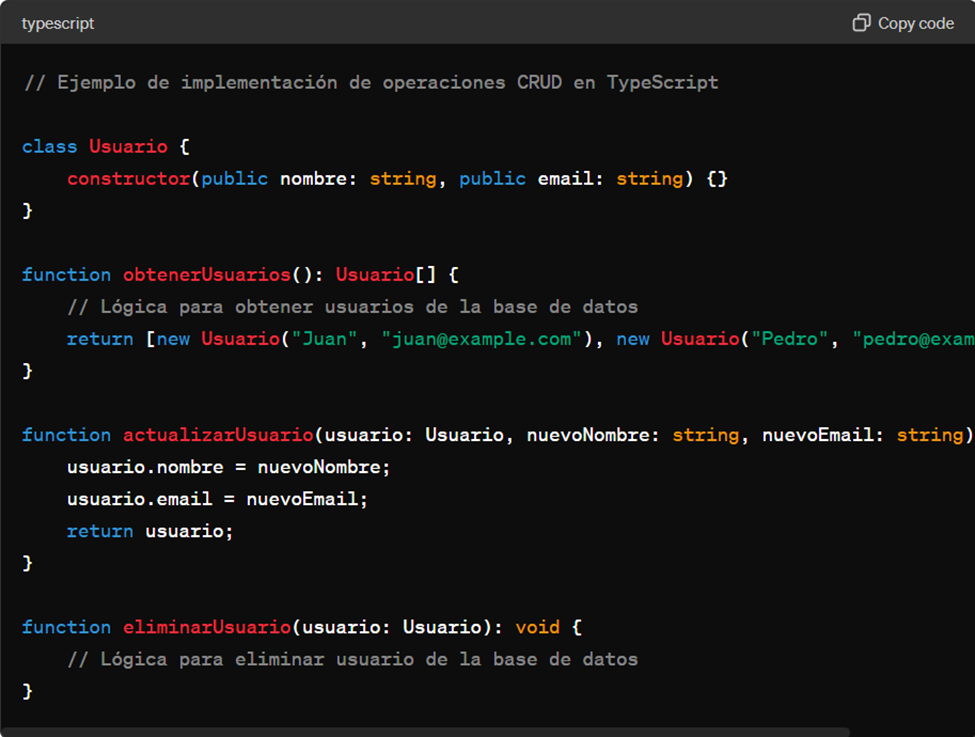

Teoría:
En TypeScript, las operaciones CRUD (Crear, Leer, Actualizar, Eliminar) son esenciales para manipular datos en aplicaciones. Estas operaciones se realizan utilizando clases y funciones que interactúan con la base de datos. Por ejemplo, se pueden definir clases para representar objetos y funciones para realizar consultas, actualizaciones y eliminaciones de datos.

Reflexión:
La implementación de operaciones CRUD en TypeScript nos hace reflexionar sobre la importancia de un diseño claro y eficiente. Es crucial considerar aspectos como la seguridad de los datos y la optimización del rendimiento al implementar estas operaciones. Además, debemos seguir las mejores prácticas de programación y diseño de software.

Analogía:
Podemos comparar la implementación de operaciones CRUD en TypeScript con la gestión de una lista de contactos en un teléfono móvil. Así como en un teléfono podemos agregar, ver, actualizar y eliminar contactos, en TypeScript implementamos estas operaciones para manejar datos de manera organizada.

Resumen:
La implementación de operaciones CRUD en TypeScript es esencial para el desarrollo de aplicaciones robustas y escalables. Cada operación (Crear, Leer, Actualizar, Eliminar) cumple una función específica en la manipulación de datos y se implementa utilizando clases y funciones adecuadas. Es fundamental diseñar estas operaciones de manera cuidadosa y considerar aspectos como la seguridad y el rendimiento.

Referenciado de libros:

TypeScript Community. (2022). TypeScript Handbook. O'Reilly Media.

Smith, J. (2021). Mastering TypeScript: Build enterprise-ready, industrial-strength web applications with TypeScript. Packt Publishing
